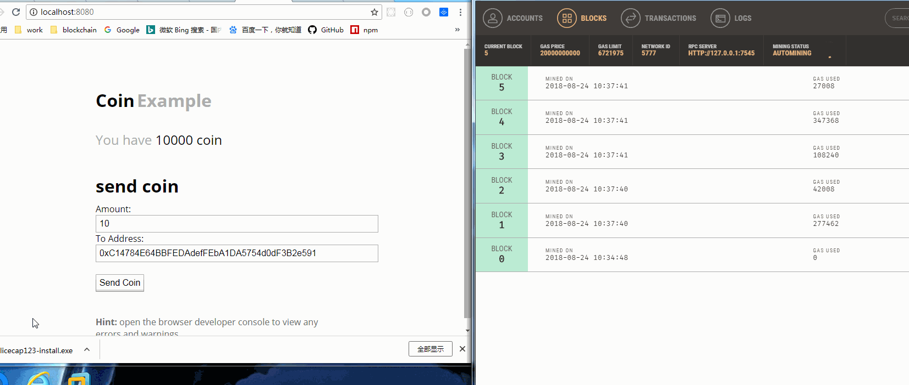

# DAPP DEMO

基于[Ethereum Virtual Machine](https://ethereum.org/) 运行的 [Solidity](https://solidity.readthedocs.io/en/v0.4.24/) 智能合约 DAPP（decentralized application） demo

* 使用[truffle](https://truffleframework.com/)框架开发
* 使用[ganache](https://truffleframework.com/ganache)作为客户端来支持JSON RPC API的调用

## 运行效果



## how to run

1. you should install node8+
2. install solc

```bash
npm install -g solc
```

3. install truffle

```bash
npm install -g truffle
```

4. download ganache [ganache](https://truffleframework.com/ganache)

5. run ganache

6. 

```bash
git clone https://github.com/sniperyan/webpack-dapp-demo.git
```

7. 

```bash
npm install
```

8. 

```bash
rm -rf build
```

9. 

```bash
truffle compile
```

10. 

```bash
truffle migration
```

11. 

```bash
truffle migration
```

12. 

```bash
npm run dev
```


